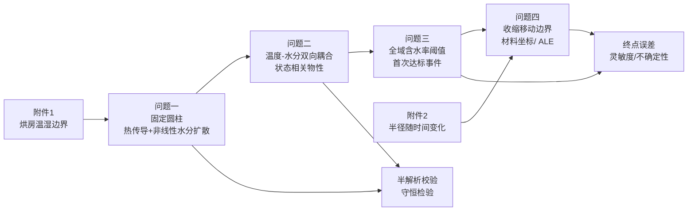

# 2026 国赛 A 题深度研究：四问模型竞争力、含金量、奖项潜力与 Codex 落地路线

## 执行摘要与总体判断

我对题面、你给出的六个 Excel 文件以及现有草案进行了交叉审阅。题目本质上不是一个“找一个最炫算法”的问题，而是一个非常典型、同时也非常适合做出高水平竞赛论文的**非稳态热—质传递、非线性物性、阈值事件、移动边界**问题。题面四问天然构成一条逐层升级的物理链：

题面明确要求：问题一给出预热阶段径向温湿分布；问题二建立整个烘干过程的温湿场；问题三求“各处均低于 0.15 kg/kg”的首次达标时间；问题四进一步考虑附件二给定的半径收缩。fileciteturn0file1 你当前草案已经抓住了这个结构，提出“**一维圆柱径向有效热质传递 → 状态依赖非线性耦合 → 全域首次达标 → 材料坐标收缩**”的主线，我认为这个总方向是对的，而且明显强于把四问各自用一个互不相干的算法来拼接。fileciteturn0file0

**最重要的结论是：不要为了“模型看起来高级”把主线改成 PINN、Transformer、LSTM 或纯机器学习。** 2024 年已有专门针对食品干燥的 CPINN 工作，2026 年又已有 Fourier-feature embedded PINN 直接研究植物组织耦合热质传递；也就是说，单纯“把 PINN 用到本题”在 2026 年已经不属于原创。更关键的是，2024 CPINN 首次训练在论文基准中耗时 321 min，而对应数值解约 82.7 min；2026 FFE-PINN 的二维案例训练约 21.23 min，而论文中的 COMSOL FEA 约 5 s。PINN 真正有优势的场景是**大量参数工况的重复预测、反问题或者数据融合**，而不是本题这一组低维、方程明确的正问题。citeturn6search16turn6search2

相反，你们现在的 **FVM + BDF/Radau + 非线性通量 + 网格收敛 + 守恒残差 + 独立半解析/FEM校验** 并不“低端”。2024 年仍有研究使用 OpenFOAM 有限体积法建立共轭热—湿传递干燥模型并获得实验一致性；2025 年关于香蕉收缩干燥的研究则使用三维 FEM 与 ALE 处理几何变形。真正决定模型“含金量”的不是 FVM 还是 PINN 这三个字，而是模型闭合是否合理、离散是否守恒、误差是否量化、结论是否能解释。citeturn6search11turn6search3

对你当前草案，我给出的总体评价是：

| 维度 | 当前草案 | 完善后的合理上限 |
|---|---:|---:|
| 物理建模完整性 | 8.5/10 | 9.5/10 |
| 数学推导含金量 | 8.0/10 | 9.3/10 |
| 数值方法可信度 | 6.5/10，因为现在主要还是方案设计 | 9.5/10 |
| 创新性 | 7.5/10 | 9.0/10 |
| 鲁棒性与误差分析 | 7.0/10 | 9.3/10 |
| 可复现性 | 7.0/10 | 9.5/10 |
| 竞赛综合竞争力 | **国二—国一候选框架** | **有实质竞争力的国一框架** |
| 独立学术发表能力 | 一般 | 经赛后扩展可达到应用型期刊水平 |
| 顶会/顶刊能力 | 不够 | 仍需全新方法、实验或多尺度物理突破 |

这里的“国一候选”绝不是获奖概率预测。以 2024 年本科组为例，全国一等奖仅 296 队，占本科参赛队约 0.5%，二等奖约 2.03%；因此**模型框架好只是入场券，任何边界条件、单位、结果文件、网格精度或论文表达错误都足以把国一框架降到国二甚至省奖**。citeturn9search2

还有一件现在必须特别注意：2026 年竞赛官方已经明确允许 AI 工具用于辅助，但要求核心建模与分析由参赛队主导、逐项人工审查核实，并在论文中设置“AI 工具使用声明”，支撑材料还要提交“AI工具使用详情.pdf”；把未经必要人工核验的 AI 生成内容直接作为核心建模成果提交，可被取消评奖资格。因此下面给出的 Codex 任务书应被你们视作**代码实现和检查清单，而不是可以不审核直接提交的答案**。citeturn5view0

## 数据结构、关键假设与“含金量”的判断标准

我直接解析了你上传的 Excel。附件一共有 241 个数据时刻，时间从 0 到 14400 s，间隔 60 s，包括烘房温度和烘房水分浓度；附件二共有 145 个时刻，从 0 到 259200 s，即 72 h，间隔 1800 s，药材半径从 2.000 cm 收缩到 1.198 cm。附件一在 9000–14400 s 已基本进入平台，温度均值约 \(50.0049^\circ C\)，范围约 \(49.757\sim50.246^\circ C\)，环境水分浓度均值约 0.049994 kg/kg；这使“4 h 后取约 \(50^\circ C,0.05\)”成为一个有数据基础、但仍必须声明为**边界延拓假设**的处理。

题面给出的 result1、result2 都有“温度”和“水分浓度”两个工作表，result3、result4 为水分浓度表；模板中的“…”只是示意，不能把现有几行、几列当作实际输出尺寸。题面对这些文件的时间与空间间隔有明确要求。fileciteturn0file1

本题正式计算建议采用以下统一假设。

| 假设 | 建议处理 | 风险级别 |
|---|---|---|
| 几何 | 圆柱横截面轴对称，主模型只保留径向 \(r\) | 中 |
| 端面 | 主模型忽略 25 cm 长度方向端面传递；二维轴对称模型做敏感性验证 | 中 |
| 环境边界 | 0–4 h 插值附件1；4 h 后主情景取平台值，并另做末值/均值敏感性 | 高 |
| 空气水分与药材干基含水率 | 在题设缺少吸附等温线情况下，将环境量视为题目给出的等效边界含水率 | 高 |
| 潜热 | 主模型不额外加入，因为题目没有给完整相变闭合参数；作为赛后研究扩展 | 中 |
| 问题四长度变化 | 长度不变，仅半径变化 | 中 |
| 内部收缩 | 材料点按 \(r/R(t)\) 均匀径向收缩 | 高 |
| 半径插值 | 主线分段线性，PCHIP 作为敏感性对照 | 低 |
| 72 h 后半径 | 禁止无约束外推；若未达标，应明确“数据区间内未达标”后再另设平台情景 | 高 |

这里尤其需要强调两个判断。

第一，**因果推断不是本题的优质主模型候选**。你没有多组受控处理、反事实样本、内部温湿实测结果，更没有可以识别 \(do(T)\)、\(do(h_m)\) 效果的实验设计。因此强行画 DAG、做倾向得分或者双重机器学习，只会成为“为了有因果模型而做因果模型”。本题真正需要的是机理 PDE、数值分析、敏感性和不确定性传播。

第二，评价“含金量”应该把“算法新颖程度”和“竞赛价值”分开：

\[
\text{竞赛含金量}
\approx
0.25P+0.20V+0.20R+0.15I+0.10U+0.10E,
\]

其中 \(P\) 是物理正确性，\(V\) 是验证与收敛，\(R\) 是结果解释与鲁棒性，\(I\) 才是创新，\(U\) 是不确定性分析，\(E\) 是表达和可复现性。一个没有守恒检验的 FFE-PINN 往往不如一个推导扎实、误差明确的 FVM。

本文后续的计算量估计统一假设：Python/NumPy/SciPy，普通 8 核 CPU、16–32 GB 内存；深度学习方案另假设一张 8–16 GB GPU。以下时间是**工程量级估计，不是对你机器的实测基准**。

## 问题一：预热阶段模型选择

问题一本质上最“干净”。题目使用附录二：\(\rho,c_p,k\) 均为常数，而扩散系数只依赖 \(C\)，所以在采用题设给定边界变量闭合后，**热场与水分场实际上是解耦的**。这点在你草案里已经修正得很好。fileciteturn0file0

推荐的控制方程为

\[
\rho c_p\frac{\partial T}{\partial t}
=
\frac1r\frac{\partial}{\partial r}
\left(rk\frac{\partial T}{\partial r}\right),
\]

\[
\frac{\partial C}{\partial t}
=
\frac1r\frac{\partial}{\partial r}
\left(rD(C)\frac{\partial C}{\partial r}\right),
\qquad
D=7\times10^{-9}e^{-0.89/C}.
\]

中心为对称边界，表面使用 Robin 对流边界。题面给定的几何、初值、物性和输出时刻见题面第一页及附录二。fileciteturn0file1

| 候选 | 假设、输入与预处理 | 超参数、训练/验证 | 指标与模板输出 | 优缺点、创新和风险 | 可行性 |
|---|---|---|---|---|---|
| **一维环形 FVM + BDF/Radau** | 输入附件1；温湿边界线性/PCHIP插值；圆柱径向对称；忽略端面 | 无“训练”；调 \(N=80,160,320\)、rtol \(10^{-6}\sim10^{-8}\)、面扩散系数处理方式；做网格和容差收敛 | 半解析热场误差、质量平衡残差、最大绝对误差；输出 result1 两个 sheet | **优：守恒、稳定、代码可控、后三问复用。缺：方法本身不新。创新：2/5；竞赛价值：5/5。风险：表面 Robin 离散错误** | CPU 数秒到约 1 min；**极高** |
| **Fourier–Bessel 半解析热场 + 数值水分场** | 热物性常数，因此热方程可做圆柱 Bessel 展开；水分 \(D(C)\) 不能直接精确线性化 | 模态数 10–100；特征根精度；与 FVM 双向比对 | \(L_\infty,L_2\) 温度误差；result1仍由主模型输出 | **优：非常强的独立程序校验。缺：不能完整处理非线性水分。创新1/5，验证价值5/5** | 秒级；**极高** |
| **二维轴对称 FEM** | \(r-z\) 域；需要假设侧面与端面边界是否相同 | 网格尺寸、二次/一次单元、时间步；与一维中截面对照 | 一维与二维的最大差异、端面敏感性 | **优：能回答“一维是否够好”。缺：额外边界假设。创新2/5，竞赛价值4/5** | 数分钟；**高** |
| **Bessel/Galerkin 降阶状态空间模型** | 用若干径向模态展开 \(T,C\)；非线性 \(D\) 在线更新 | 5–30 个模态；积分容差；用 FVM 作基准 | 场误差、速度提升倍数 | **优：数学味浓、解释性强。缺：表面强梯度下模态数可能上升。创新3/5** | 秒级；**高** |
| **CPINN/PINN** | \(r,t\to T,C\)，损失包含 PDE、初边值；无需内部标签 | 4–8 层、64–256宽度、1e4–1e5配点、Adam+L-BFGS、损失权重和随机种子 | 相对 FVM 的 \(L_2\)/最大误差、边界残差 | **优：连续解、前沿感。缺：本题无逆问题，训练比数值法贵；已有食品干燥 CPINN 工作，原创性有限。创新展示3/5，竞赛ROI 2/5** citeturn6search16 | GPU 数十分钟至数小时；**中** |

**最佳方案：一维环形有限体积主解 + Fourier–Bessel 热场独立校验。**

这比“只用 FVM”含金量明显更高，因为你不仅给答案，还回答了一个评委非常关心的问题：**你怎么知道程序没有把 \(1/r\)、中心边界或 Robin 边界写错？**

**给 Codex 的端到端实现任务书：**

① 读取 `附件1.xlsx`，将时间变成 s，温度保持摄氏度，建立 `T_air(t)`、`C_air(t)` 分段线性函数；检查时间单调、缺失值、重复点。  
② 创建 `properties_q1(C)`，返回 \(\rho=820,c_p=2600,k=0.36,D(C)\)，并添加 `assert C>0`。  
③ 用 \(N=160\) 个环形控制体离散 \(0\le r\le0.02\) m，计算每个控制体体积 \(V_i\) 和面面积 \(A_{i\pm1/2}\)，中心面面积自然为 0。  
④ 热方程使用相邻单元共享面热流；水分方程首版用调和平均 \(D_f\)，增强版加入 Kirchhoff 积分通量并比较差异。  
⑤ 表面不要把最后一个单元中心直接当成表面值；用半控制体热阻与 Robin 条件联立求表面通量。  
⑥ 将 \(2N\) 个状态交给 `solve_ivp(method="BDF")` 或 `Radau`，先取 `rtol=1e-7`，分别为温度、含水率设置尺度合理的 `atol`。  
⑦ 用 \(N=80,160,320\) 重算，在题目指定时刻与位置比较；热场额外写 Fourier–Bessel 校验程序，目标是 result1 四位小数在网格加密后稳定。  
⑧ 将数值解连续插值到 \(t=1,2,\ldots,1800\) s 和 \(r=0,0.001,\ldots,0.02\) m，生成 `result1.xlsx` 的“温度”“水分浓度”两个工作表；同时抽取 100、300、600、900、1200、1500、1800 s 与五个题定位置生成论文表格。fileciteturn0file1

**这一问的奖项作用：**本身不是拉开国一等奖差距的问，但它决定整篇论文是否可信。做好半解析校验和网格收敛，比在这一问加入神经网络更有价值。

## 问题二：整个烘干过程的非线性热质耦合

问题二是真正的核心物理问。附录三给出

\[
\rho(C)=650+128C,
\]

\[
c_p(C)=1450+2736\frac{C}{C+1},
\]

\[
k(C)=0.21+0.38\frac{C}{C+1},
\]

\[
D(C,T)
=
2.4\times10^{-3}
e^{-0.45/C}e^{-3850/T_K}.
\]

因此存在完整反馈：

\[
T
\rightarrow D(C,T)
\rightarrow C
\rightarrow
\{\rho,c_p,k\}
\rightarrow T.
\]

并且题目明确说问题二统一采用附录三经验式，因此应从 \(t=0\) 重新积分，不能把问题一 1800 s 的状态作为问题二初值直接接上。fileciteturn0file1

| 候选 | 假设、输入、预处理 | 超参数与训练/验证 | 指标及输出 | 优缺点、创新和风险 | 可行性 |
|---|---|---|---|---|---|
| **状态相关一维耦合 FVM + 全隐式 BDF** | 附件1边界；4 h后平台延拓；每次残差重新算 \(\rho,c_p,k,D\) | \(N=100\sim400\)；BDF容差；Picard/Newton策略；网格收敛 | 温湿场网格误差、守恒残差、边界残差；result2 | **物理利用率最高，算法可解释，四问复用。创新3/5，竞赛价值5/5。风险：低C区刚性、边界梯度** | 约 1–10 min CPU；**极高** |
| **二维轴对称耦合 FEM** | 增加 \(z\) 方向；端面需额外假设 | 网格、单元阶次、时间容差；与1D中截面比较 | 端面导致的径向输出偏差 | **优：模型完整度高。缺：题目没有端面独立边界数据；可能复杂而无收益。创新3/5** | 5–60 min；**高** |
| **2024 CPINN 型耦合网络** | 两个网络或多输出网络求 \(T,C\)，动态物性写入 PDE loss | 网络深宽、配点、loss weights、Adam/L-BFGS、transfer learning | 与FVM场值 MAE、PDE residual、运行时间 | 已有研究专门处理动态热物性、蒸发及扩散耦合；首次训练慢，但迁移学习在多工况下可提速。**前沿性4/5、本题原创性2/5** citeturn1search0 | GPU 小时级首训；**中** |
| **2026 FFE-PINN** | Fourier feature 编码 \((r,t)\)，同时训练温度、水分网络 | Fourier频率尺度/维度、深宽、配点密度、loss动态权重 | \(L_2\)、边界最大误差、不同随机种子稳定性 | 2026 最新植物组织干燥工作显示 Fourier embedding 能改善 PINN 学习稳定性，但其二维案例仍比 FEA 求解昂贵，且已是公开路线。**前沿5/5、原创2/5、竞赛ROI2/5** citeturn6search2 | 10 min–数小时 GPU；**中低** |
| **DeepONet/神经算子代理** | 先由 PDE 生成大量 \(T_\infty(t),C_\infty(t),h_m\) 等不同工况，再学“边界函数→场”映射 | 约 \(10^3\!-\!10^4\) 工况；branch/trunk 宽度、latent dim、学习率 | 留出工况相对误差、推理时间 | Neural operator 的优势是一次训练后预测整个 PDE 家族，而非单一实例；只有做大量敏感性/优化时才值得。citeturn7search0 **创新4/5，竞赛必要性1/5** | 数据生成+训练数小时；**低** |

前沿文献对你们路线最重要的启示其实不是“必须上 PINN”，而是反过来的：**经典数值求解器仍然应该是基准真值；SciML 更适合在已有可靠 PDE 基准之后做快速代理。** 2026 FFE-PINN 论文自己也以 FEA 和实验数据作为比较基准，而且报告误差主要集中在边界强梯度区域，这正好提醒你们重点做好表面离散。citeturn0search0

**最佳方案：一维非线性双向耦合 FVM + BDF；二维 FEM 只用于端面敏感性。**

可增加一个很划算的“半前沿”增强：当温场进入平台以后，构造

\[
E_T(t)=\max_r|T(r,t)-T_\infty|
\]

并检测 \(E_T<0.1^\circ C\) 持续一段时间后切换为准等温水分模型。然后与完整耦合模型比较。这个扩展比 PINN 更容易产生真正有说服力的论文内容，因为它给出了**模型降阶条件和误差—效率权衡**。

**给 Codex 的端到端实现任务书：**

① 复用问题一数据层和 FVM 几何层，但新建 `properties_q23(C,T_C)`；扩散式中的温度必须先转 Kelvin：`T_K=T_C+273.15`。  
② 从初态 \(T=28^\circ C,C=2.55\) 重新开始，不加载 result1 的 1800 s 状态。  
③ 每次 RHS/残差评价都根据当前 \(C,T\) 更新所有物性，尤其不要提前把 \(D\) 固定。  
④ 内部热通量建议使用面 \(k\) 的调和平均；水分通量比较调和平均 \(D\) 与 Kirchhoff 非线性差商两种方案。  
⑤ 将附件1数据用到 14400 s；之后创建三个环境延拓情景：平台均值、最后一个观测值、近 1.5 h 均值，主结果采用平台均值，其余只做敏感性。  
⑥ 完整耦合求解至少到问题三终止事件；同时计算 \(E_T(t)\)，找到潜在准等温切换时间，再运行降阶模型与完整解对比。  
⑦ 做 \(N=80,160,320\) 与求解容差 \(10^{-6},10^{-7},10^{-8}\) 交叉检验，重点比较表面/中心含水率和后续问题三的终点时间，而不是只看早期温度。  
⑧ result2 的论文表格抽取 0.5–3 h、每 0.5 h 和五个位置。对 Excel 文件，题面“建立整个烘干过程……将完整结果保存”的字面解释更倾向于全过程每 1 s 输出；程序建议提供 `q2_export_end="full"|"3h"` 配置，主版本保存全过程，便于应对格式解释差异。fileciteturn0file1

**这一问的竞赛含金量非常高。** 真正值得写成“创新点”的不是“使用 BDF”，而是：

> 状态依赖物性造成的双向耦合 + 强非线性扩散 + 自适应刚性积分 + 完整/准等温降阶误差比较。

这比把“用了 PINN”写成创新点更稳。

## 问题三：全域首次达标时间、鲁棒性和终点可信度

问题三表面上只是“求一个时间”，实际上是本题最容易失分、也最容易把论文做出层次的一问。

题目要求的是**药材各处水分浓度均低于 0.15 kg/kg**。fileciteturn0file1 因此正确数学对象不是平均含水率，而是

\[
g(t)=\max_{0\le r\le R}C(r,t)-0.15,
\]

\[
t_*=\inf\{t:g(t)<0\}.
\]

| 候选 | 假设、输入、预处理 | 超参数/验证 | 指标和输出 | 优缺点、创新与风险 | 可行性 |
|---|---|---|---|---|---|
| **完整 PDE + 全域最大值事件定位** | 直接继承Q2；每个积分状态在细网格求空间最大值 | 事件 root tolerance；空间重建；Brent/bisection | \(t_*\)、最大含水位置、终点场；result3 | **题意最准确。创新3/5，竞赛价值5/5。风险：只检查5个表格点或每6h判定会错过真实终点** | 分钟级；**极高** |
| **中心点判停 + 单调性数值验证** | 假设始终 \(C_r\le0\)，中心最湿 | 每个时刻验证径向单调；与全域方法比较 | \(t_{\rm center}-t_*\) | **优：解释简洁。缺：只能作为验证后的结论，不能先验假定。创新1/5** | 极高 |
| **全局敏感性/区间 UQ + 事件传播** | 扰动 \(h_m,D\) 倍率、环境平台、T平台 | 扰动±5/10%；Sobol 或 Morris 样本；每次均求 \(t_*\) | 灵敏度指数、时间包络 | **很适合国赛：回答结果“稳不稳”。创新4/5、竞赛价值5/5。风险：题设参数不是随机变量，不能乱称95%置信区间** | 数十至数百次PDE；10–60 min |
| **Gaussian Process / XGBoost 终点代理** | 由物理模型生成参数→\(t_*\) 数据 | 100–1000 个Latin Hypercube样本；核参数/树深 | CV-RMSE、MAE、代理速度 | **适合敏感性扫描，不适合替代正式 PDE。创新3/5。风险：样本全是自己模拟，不能冒充实验数据** | 高 |
| **最坏情形鲁棒达标模型** | 参数取可信区间 \(\Theta\)，定义 \(\max_{\theta\in\Theta}\max_r C<0.15\) | 外层优化器/采样密度 | 名义终点和“保证达标”终点 | **数学层次高，适合扩展。创新4/5。缺：题目没要求概率或最坏工况，不能取代正式答案** | 中高 |

这里的第三候选其实比很多深度学习扩展更值得做。因为第三问真正的科学问题不是“某一个求解器给了 51.2345 h”，而是：

> 如果末期最大含水率曲线非常平，那么 \(10^{-4}\) 量级的含水率离散误差会造成多大的终点时间偏差？

在最大位置稳定的条件下有近似关系

\[
|\delta t_*|
\approx
\frac{|\delta C_{\max}|}
{\left|\frac{dC_{\max}}{dt}(t_*)\right|}.
\]

这可以把“网格收敛”与最终需要提交的“烘干时长”直接联系起来，是非常有评委价值的误差分析。

你现有草案提出后期低含水率表层导致 \(D\) 强烈下降，这个判断也很有价值。根据题目附录三公式，在 \(50^\circ C\) 下仅改变含水率，从 \(C=0.15\) 到 0.05，扩散率会出现数量级下降。这意味着后期表面附近的强梯度可能成为真正控制网格误差的位置。fileciteturn0file1 近期食品干燥研究也反复观察到内部传质阻力和收缩对后期干燥行为具有显著影响。citeturn6search0turn6search1

**最佳正式方案：完整 PDE + 全域最大值首次过阈值事件；附加灵敏度/UQ。**

**给 Codex 的端到端实现任务书：**

① 从问题二完整模型继续积分，但不要读取 result2 的四舍五入结果；直接复用全精度状态。  
② 定义函数 `g_state(y)=max(C_reconstructed(y))-0.15`，空间最大值至少覆盖所有 FVM 单元中心、中心轴重建值和真正表面值。  
③ 绝不能只取 \(r=0,0.5,1,1.5,2\) cm 五个位置判停。  
④ 当粗积分发现 \(g(t_i)>0,g(t_{i+1})<0\) 后，利用 `dense_output` 或短区间重新积分，在该区间用 Brent 法求 \(g(t)=0\)。  
⑤ 因题意是严格 `<0.15`，将零点视为临界时刻；报告时可定义首次达标时间为零点后一数值可分辨时刻，同时说明连续模型意义下临界点为 \(C_{\max}=0.15\)。  
⑥ 在 \(N=80,160,320\) 和不同时间容差下重新求 \(t_*\)，要求终点时间对网格/容差变化稳定；同时计算上式的 \(\delta C\to\delta t\) 误差传播。  
⑦ 运行敏感性：\(h_m\times(0.9,1,1.1)\)、\(D\times(0.9,1,1.1)\)、平台环境 \(C_e\) 与温度的合理扰动，输出 Tornado 图或敏感度表。  
⑧ `result3.xlsx` 按每 60 s、每 0.1 cm 输出，直到终点；如果 \(t_*\) 不是 60 s 整数倍，建议文件最后补一行真实终点，论文表5则列每 6 h 及终点的 0、0.5、1、1.5、2 cm 数值。fileciteturn0file1

**这一问是非常强的“国一增益点”。** 很多队会算“中心降到 0.15 的时间”或者“平均含水率低于 0.15 的时间”；你们如果明确构造全域事件、定位误差、终点灵敏度，论文层次会明显不同。

## 问题四：收缩移动边界的五条路线

这是整道题最有希望成为**主创新点**的一问。

附件二不是额外给一个普通参数，而是给出了一个随时间变化的几何：

\[
R=R(t).
\]

你上传的数据中，半径从 2.000 cm 降到 1.198 cm；6 h、12 h、24 h附近分别约为 1.374、1.248、1.204 cm。因此如果还在固定 \(0\le r\le2\) cm 域上直接算，就已经不再对应真实药材区域。

近年领域前沿也确实正在从“固定几何 Fick 扩散”向“热—湿—变形耦合”发展：2025 年香蕉干燥工作采用三维 FEM + ALE 描述收缩；2025 年油茶籽工作同时模拟热、质传递和收缩并用实验验证；2026 年香菇研究进一步把 shrinkage、Flory–Huggins、水活度和黏弹性纳入多相多尺度模型。citeturn6search3turn6search1turn1search4

| 候选 | 假设、输入及预处理 | 参数与验证 | 指标及输出 | 优缺点、创新和风险 | 可行性 |
|---|---|---|---|---|---|
| **材料坐标 \(\xi=r/R(t)\) + 一维 FVM** | 附件2直接驱动 \(R(t)\)；长度固定；径向仿射收缩 | R线性/PCHIP；\(N\)；BDF容差；质量平衡 | \(t_4^*\)、动态表面值、干基质量残差；result4 | **最适合本题。数学推导有含金量、代码可复用。创新4/5、竞赛价值5/5。风险：内部均匀收缩是假设** | 2–15 min；**极高** |
| **二维轴对称 ALE-FEM** | 网格随边界移动；可加入端面 | 网格平滑/ALE参数、时间步、单元质量 | 与材料坐标模型的场/终点差 | ALE 已广泛用于收缩干燥研究。**创新3/5、验证价值5/5** citeturn6search3 | 10–120 min；**中高** |
| **状态空间/经验收缩—扩散耦合** | 用附件2拟合 \(R(t)\) 或 \(R(C)\)，再耦合扩散 | 单调样条、指数/幂律参数；留点验证 | 半径 RMSE、终点误差 | 2024 年已有研究用 state-space 方法处理带收缩的干燥扩散。citeturn6search6 **优：简洁；缺：\(R(C)\) 缺直接平均含水率实测，易循环论证** | 高 |
| **PINN-MT + PINN-shrinkage 多域耦合** | 网络同时求质量传递和非线性变形 | 多网络、domain decomposition、loss weights | PDE残差、半径和含水场误差 | 2024 已有专门的植物细胞非均匀收缩 PINN 框架。citeturn6search4 **前沿5/5，但应用到本题原创2/5；算力和调参风险高** | 中低 |
| **多相热—湿—力 THM/多孔介质模型** | 液水、水汽、气体、固体骨架和应变全部守恒 | 孔隙率、渗透率、吸附、水活度、弹性/黏弹性参数众多 | 全场温湿、相分率、应变 | 这是科研级物理上限；文献显示收缩可显著反馈热质传递。citeturn6search14turn1search4 **创新潜力5/5，但本题参数严重不足，极易“过度建模”** | 低 |

推荐使用材料坐标

\[
\xi=\frac{r}{R(t)},\qquad 0\le \xi\le1.
\]

令

\[
u(\xi,t)=C(R(t)\xi,t),\qquad
\vartheta(\xi,t)=T(R(t)\xi,t).
\]

在“干固体随材料运动、径向仿射收缩”的闭合下，材料速度为

\[
v_r=\frac{\dot R}{R}r.
\]

把欧拉坐标时间导数与材料对流项一起变换后，几何对流项可以抵消，得到固定参考域：

\[
u_t=
\frac{1}{R(t)^2\xi}
\frac{\partial}{\partial\xi}
\left(
\xi D(u,\vartheta)u_\xi
\right),
\]

\[
\rho(u)c_p(u)\vartheta_t=
\frac{1}{R(t)^2\xi}
\frac{\partial}{\partial\xi}
\left(
\xi k(u)\vartheta_\xi
\right),
\]

表面条件变为

\[
-\frac{D}{R}u_\xi=h_m(u_s-C_e),
\]

\[
-\frac{k}{R}\vartheta_\xi=h(\vartheta_s-T_\infty).
\]

你当前草案对“为什么没有额外收缩对流项”进行了专门守恒推导，这是**整篇现有文稿中数学含金量最高的部分之一**。fileciteturn0file0

但论文里必须明确：

> 这不是“几何换元以后对流项神奇消失”，而是因为起始模型已经采用材料守恒形式，并假设材料点随均匀收缩速度移动。

如果直接从一个不带材料速度的 Eulerian 方程变换，则会出现显式网格运动项。这两个模型不能混写。

**我强烈建议保留你草案中的四组因素分离：**

\[
A:\ R_0+\text{附录三},
\quad
B:\ R(t)+\text{附录三},
\]

\[
C:\ R_0+\text{附录四},
\quad
D:\ R(t)+\text{附录四}.
\]

这样可以定义

\[
\Delta_{\rm geom}=t_B-t_A,
\]

\[
\Delta_{\rm prop}=t_C-t_A,
\]

\[
\Delta_{\rm int}=t_D-t_B-t_C+t_A.
\]

这比简单说“问题四比问题三快了多少小时，因此都是收缩造成的”高级得多，因为问题四同时换了经验物性公式；不做因素分离就存在明显归因错误。

**给 Codex 的端到端实现任务书：**

① 读取 `附件2.xlsx`，检查半径单调性；主函数 `R(t)` 使用分段线性插值，另建 PCHIP 版本做敏感性；禁止默认 extrapolate。  
② 将空间变量改成 \(\xi\in[0,1]\)，创建固定的 FVM 网格；每次 RHS 根据当前 `R(t)` 重算物理面面积和 \(1/R^2\) 系数。  
③ 建立附录四物性函数，并从 \(t=0\) 初态重新计算，不继承问题三状态。  
④ 表面热/质 Robin 边界中的梯度换算必须有 \(1/R(t)\)；这是最容易漏掉的实现错误之一。  
⑤ 记录 `R(t)`、\(u(0,t)\)、\(u(1,t)\)、平均干基含水率和表面通量，并验证归一化干基质量平衡

\[
\bar C(t)-\bar C(0)+
\int_0^t\frac{2h_m}{R(\tau)}
[u_s-C_e]\,d\tau \approx0.
\]

⑥ 分别运行 A/B/C/D 四组场景，所有组使用完全相同的数值网格、容差和环境边界，计算几何、物性和交互贡献。  
⑦ 与一个二维 ALE 或至少一个“直接动态网格有限体积”小规模实现交叉验证，重点比较中心、表面和终止时间；2025 年 ALE 收缩干燥工作可作为方法依据。citeturn6search3  
⑧ 填 result4 时，输出列表示**固定物理距离**：某时刻若 \(r_j>R(t)\)，该点已经在药材之外，应该留空/NaN，而不是写 0 或复制表面值；另外始终单独保留“药材表面”列，对应 \(u(\xi=1,t)\)。题面表6本身就把“药材表面”列单独列出。fileciteturn0file1

**这是最值得冲击国一的问。** 如果只能精做一个附加分析，我会选择“移动域守恒推导 + 四因素分解”，而不是 PINN。

## 对现有草案的逐项竞争力与含金量评价

你现在这份 `A题_各问模型选择与整体方法建议.md` 最大的优点，是它没有陷入“每一问换一个模型名称”的常见竞赛误区，而是已经形成一套统一物理骨架。fileciteturn0file0

我对其中主要模块的评价如下。

| 草案中的内容 | 建模含金量 | 竞赛竞争力 | 我的评价 |
|---|---:|---:|---|
| 一维圆柱 FVM 主线 | ★★★☆☆ | ★★★★★ | 算法经典，但**极适合题目**。不要因为“不花哨”换掉 |
| 问一解耦热/质场 | ★★★★☆ | ★★★★☆ | 对题目结构理解准确，是比“全程强耦合”更严谨的修正 |
| Bessel 半解析热校验 | ★★★★☆ | ★★★★★ | 非常值得保留，是程序可信度的重要来源 |
| 问二非线性双向耦合 | ★★★★☆ | ★★★★★ | 正式主模型核心 |
| 后期准等温降阶 | ★★★★☆ | ★★★★☆ | 有模型分析味道；必须给误差和加速比 |
| Kirchhoff 非线性面通量 | ★★★★☆ | ★★★★☆ | 很不错的数值增强，但**不是原创数学方法**，不要包装为“提出新变换” |
| 问三全域首次达标事件 | ★★★★☆ | ★★★★★ | 非常强，严格对应题意 |
| 后期低扩散率表层分析 | ★★★★☆ | ★★★★★ | 能解释为什么网格/终点敏感，非常值得画图 |
| 灵敏度与终点误差传播 | ★★★★★ | ★★★★★ | 国一论文非常应该有的内容 |
| 问四材料坐标收缩 | ★★★★★ | ★★★★★ | 目前全文最强模块 |
| 收缩对流项抵消的守恒推导 | ★★★★★ | ★★★★★ | 数学含金量最高的部分之一 |
| A/B/C/D 因素分离 | ★★★★★ | ★★★★★ | 强烈保留；很好地解决归因问题 |
| 2D FEM 端面验证 | ★★★☆☆ | ★★★★☆ | 有时间就做，价值主要在假设验证 |
| PINN 扩展 | ★★★☆☆ | ★★☆☆☆ | 只适合作为选做，主线加入反而可能稀释论文 |
| 多相/潜热扩展 | ★★★★★ | ★★☆☆☆ | 研究含金量很高，但题设参数不足，不宜主做 |

这也解释了一个常见误区：**“高含金量模型”不等于“模型名称越复杂越好”。** 2024–2026 年的干燥研究已经出现 CPINN、FFE-PINN、ALE、多相多尺度模型等复杂框架；但这些研究通常依赖实验验证、更多物性和更复杂的物理闭合。直接在三天竞赛中复制一个研究级模型、再随意补齐十几个不存在的数据参数，会让模型从“先进”变成“不可证伪”。citeturn6search16turn6search2turn1search4

你草案还需要修补以下几个关键短板。

**边界水分解释必须写得非常谨慎。** 药材的干基含水率与空气水分浓度虽然题面均写 kg/kg，但未必具有完全相同的参照基准。现有草案将环境水分作为等效表面边界是一个合理竞赛闭合，但不能写成物理学上的严格等价。fileciteturn0file0

**不能把两个数值方法互相吻合称为实验验证。** 你们没有药材内部温湿场实验数据；FVM 与 FEM 一致只能叫“数值交叉验证”，Bessel 对照叫“程序验证”，网格加密叫“数值收敛”，参数扰动叫“鲁棒性分析”。真正的“实验验证”必须有独立实验观测。近期干燥论文之所以具有较高研究说服力，通常会同时报告模型和实验偏差，例如 2025 油茶籽研究直接比较了模拟温度、含水率和收缩与实验数据。citeturn6search1

**Kirchhoff 通量应从“创新方法”降级为“针对强非线性扩散的数值改进”。** 如果普通调和平均在 \(N=320\) 后和 Kirchhoff 通量已经基本一致，就诚实写为“验证了标准方案已收敛”；如果 Kirchhoff 明显降低网格依赖，再展示其优势。不要为了显示创新而强行宣称它优于所有方案。

**PINN 不应进入摘要前三个创新点。** 2024 CPINN 已经直接模拟液体扩散控制的耦合食品干燥；2026 FFE-PINN 更直接覆盖植物组织热质耦合。因此“我们首次将 PINN 用于中药材干燥”既难以成立，也没有必要。citeturn1search0turn0search0

**真正应该进入摘要的三条创新，建议改成：**

> 建立随物性动态变化的圆柱热—质耦合守恒模型，并通过半解析解、网格加密和守恒残差进行多层验证。

> 将“烘干完成”转化为全空间最大含水率的首次通过事件，并把场变量数值误差传播至终点时间误差。

> 基于附件半径构建材料坐标移动域模型，通过干基质量守恒推导变换方程，并利用四组对照分离收缩几何、物性变化及交互效应。

这三个创新点比“FVM+BDF+PINN”更像一等奖论文。

## 奖项与发表潜力，以及最终推荐路线

先给最直接的判断。

**以当前草案“只有设计、没有最终数值验证”的状态，它还不能支撑任何奖项预测。** 但如果你们真正把草案中承诺的计算、收敛、守恒和因素分离全部做出来，我认为模型层面已经超过普通“套公式+数值积分”的国赛论文，属于**有能力支撑全国二等奖，并具备全国一等奖竞争力**的路线。国一比例本身极低，所以这里表达的是“模型结构达到竞争级别”，而不是中奖概率。citeturn9search2

| 成果完成度 | 我对奖项支撑能力的判断 |
|---|---|
| 只做基础 FDM/FVM，直接给四问数值，没有验证 | 省级获奖到全国报送水平，国奖不稳 |
| FVM + 正确非线性耦合 + 全域事件 | 省一/国二竞争力明显 |
| 再加半解析校验 + 网格收敛 + 守恒 | **国二强竞争力** |
| 再加 Q3 终点误差/UQ + Q4 材料坐标严谨推导 | **国一候选层次** |
| 再加 A/B/C/D 因素分离 + 二维端面/移动域交叉验证 + 非常好的摘要和图表 | **模型层面属于我最推荐的冲国一路线** |
| 为了炫技加入 PINN，但没有额外信息增益 | 不会自然提高奖项，甚至可能降低完整度 |
| 上完整 THM 多相模型但大量参数来自猜测 | 风险极高，复杂度很可能成为减分项 |

你们现有路线中，**最重要的不是再加一个模型，而是把已有主模型变成“可证伪、可验证、可复现”的模型。**

推荐最终论文技术树：

\[
\boxed{
\text{Q1：一维 FVM + Bessel 验证}
}
\]

\[
\Downarrow
\]

\[
\boxed{
\text{Q2：状态相关非线性双向耦合 + BDF}
}
\]

\[
\Downarrow
\]

\[
\boxed{
\text{Q3：全域最大值事件 + 终点误差 + 灵敏度}
}
\]

\[
\Downarrow
\]

\[
\boxed{
\text{Q4：材料坐标收缩 + 守恒 + 四因素分离}
}
\]

外围只保留两项验证：

\[
\boxed{\text{二维 FEM/ALE：验证几何假设}}
\]

以及

\[
\boxed{\text{PINN/代理模型：有余力才做展示，不进入主答案}}
\]

**从学术发表角度看，当前框架本身还远不到“顶会/顶刊”。** 原因不是 FVM 不高级，而是这仍然主要是对一道已给定经验公式的应用型数值建模：没有独立实验数据、没有未知物性的反演、没有全新的通用算法、没有跨材料泛化验证。官方 2026 年赛题后续研究通知本身也明确强调，后续成果若希望作为研究论文，需要分析已有方案不足，并提出与已发表文献相比具有模型或算法创新的新方案。citeturn2search7

进一步区分：

| 目标 | 现在的框架 | 还需要增加什么 |
|---|---|---|
| 校级/省级竞赛 | 明显足够 | 正确实现即可 |
| CUMCM 全国二等奖 | **很有竞争力** | 收敛、守恒、结果解释必须齐 |
| CUMCM 全国一等奖 | **有竞争资格** | Q3/Q4亮点、图表、误差、摘要质量决定上限 |
| 《数学建模及其应用》/赛题后续研究 | 赛后可扩展 | 与优秀论文比较、增加实验/参数反演/新算法 |
| 一般食品/干燥工程 SCI | 当前不足 | 实验验证、多工况、参数辨识、统计不确定性 |
| Journal of Food Engineering / Food and Bioproducts Processing 等较强领域刊 | 需要明显升级 | 独立实验 + 更丰富物理 + 新模型或高价值应用 |
| IJHMT 一类高水平传热期刊 | 当前明显不足 | 新型多尺度/多物理方法、充分实验验证、通用性 |
| NeurIPS/ICLR 等 ML 顶会 | **完全不够** | 必须提出一般性的 SciML/神经算子/PINN 新算法并进行大规模基准测试 |

这一判断也与当前领域前沿的门槛一致：2024 CPINN 已经做了耦合干燥 PDE 与迁移学习；2024 的非均匀收缩 PINN 已经把质量传递与固体力学结合；2026 FFE-PINN 又进一步使用 Fourier 特征解决植物组织热质耦合；2026 的多相多尺度香菇模型甚至联合了收缩、黏弹性、水活度和 NMR 信息。仅把这些现成技术之一搬到 A 题，并不足以形成顶刊级创新。citeturn6search16turn6search4turn6search2turn1search4

**我的最终模型排序如下：**

| 优先级 | 内容 | 建议 |
|---|---|---|
| S | Q2 非线性耦合 FVM/BDF | 必做 |
| S | Q3 全域事件 + 终点误差 | 必做 |
| S | Q4 材料坐标 + 守恒推导 | 必做 |
| S | Q4 A/B/C/D 因素分离 | 必做 |
| A | Q1 Bessel 半解析验证 | 强烈建议 |
| A | 全过程网格/容差收敛 | 强烈建议 |
| A | 环境边界与参数敏感性 | 强烈建议 |
| B | 2D 轴对称/FEM/ALE 对照 | 时间允许则做 |
| C | 准等温降阶模型 | 有余力值得做 |
| D | CPINN / FFE-PINN | 只作为附加展示 |
| E | 完整 THM 多相模型 | 本次比赛不建议 |

因此，我不会建议你推翻现有 `A题_各问模型选择与整体方法建议.md`。fileciteturn0file0 **它的总体方向已经相当好；接下来最有价值的工作不是继续“找更高级的模型”，而是把主线的数值可信度和第四问的物理推导真正做实。**

从纯模型选择角度，我给这套方案的最终评价是：

> **“方法名称”只有中等炫技度，但“数学建模质量”非常高；完善后属于真正有国一竞争力，而不是靠堆算法制造高级感的方案。**

> **最强的三个得分点不是 PINN，而是：全域首次达标事件、移动域守恒推导、几何—物性—交互效应分解。**

> **最可能导致失分的三个点是：环境水分边界解释不严谨、问题四固定物理位置与材料坐标混淆、没有真正完成网格/终点收敛却在正文中过度声称数值可信。**

最后，在把上述 Codex 任务落地时，应同时维护一份 `model_config.yaml/json`，把网格数、求解容差、环境延拓、半径插值、物性版本、输出时域和随机种子集中记录；最终所有表格、图、result1–4 和论文数字应由**同一批最终配置的计算自动生成**。这一步看起来不“创新”，但对可复现性和避免比赛最后阶段数字互相矛盾，实际价值极高。2026 年官方 AI 使用规则也要求参赛队对 AI 辅助产生的代码和分析进行人工审查、核实并如实披露使用过程。citeturn5view0